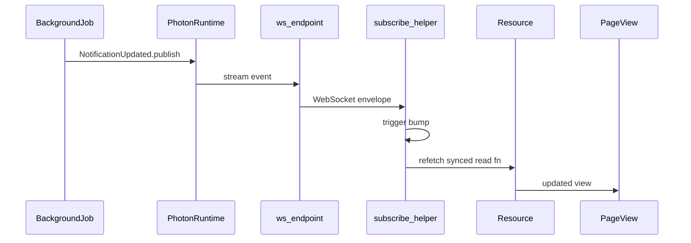

# photon-leptos

[](https://github.com/unified-field-dev/photon-leptos/actions/workflows/ci.yml)
[](LICENSE)

[GitHub](https://github.com/unified-field-dev/photon-leptos) · [photon](https://github.com/unified-field-dev/photon) · `cargo doc -p photon-leptos --open`

Leptos + Axum integration built on [photon](https://github.com/unified-field-dev/photon) — browser clients subscribe to topics over WebSockets and refetch synced server functions when events arrive.

```rust
use leptos::prelude::*;
use photon::{topic, /* ... */};
use photon_leptos::synced;

#[topic(name = "notifications.updated")]
pub struct NotificationUpdated { /* ... */ }

#[synced(
    topic = "notifications.updated",
    ws = "/ws/notifications",
    strategy = "refetch",
    auth = "none",
)]
pub async fn list_notifications() -> Result<Vec<Notification>, ServerFnError> { /* ... */ }

// Somewhere else on the server (for example after an import job finishes):
async fn on_import_job_finished(...) {
    NotificationUpdated { /* ... */ }.publish().await?;
}

// In the Leptos page (any number of viewers):
let trigger = subscribe_list_notifications(|| {});
let items = Resource::new(move || trigger.get(), move |_| list_notifications());
```

Publish can come from any server path (background job, webhook handler, another user's write)—subscribers only need the topic and synced read fn.

## Status

photon-leptos **0.1 is experimental**. Treat the browser WebSocket as an ephemeral invalidation / live-update channel:

| Strategy | Status |
|----------|--------|
| **Refetch** | Supported — server function remains the authoritative source of state |
| **Replace** | Experimental — event payload must deserialize as the success value (`T` or `Ok` of `Result<T, E>`); the macro calls `synced_resource_replace_result` for `Result` return types |
| **Append** | Best-effort live tail — buffers events during initial load; treats the socket as an ephemeral stream (Refetch after reconnect when the full list must match the server) |

Browser WebSocket is an ephemeral invalidation / live-update channel (no durable client checkpoint). Across disconnect/reconnect, prefer Refetch when exact state matters. `BroadcastHub` is process-local (not multi-replica).

**Host responsibilities:** authentication, WebSocket Origin policy (`HasPhoton::allow_ws_origin`; default denies all Origins), connection/group/rate limits, TLS, and graceful shutdown. Subscribe keys are UTF-8 (max 256 bytes, no control characters); key-mismatch responses do not echo raw keys.

**Client observability:** `subscribe_ws` returns a [`PhotonWsHandle`](https://docs.rs/photon-leptos) with reactive status, `last_error`, and `close()`. `use_topic_subscription` exposes the same signals on `PhotonSubscription`.

## About photon-leptos

photon-leptos bridges Photon pub/sub events to Leptos UIs over WebSockets. You define topics and publish from server code with **photon**; you annotate read server functions with **`#[photon_leptos::synced]`** to get client subscription helpers and automatic WS route registration; you merge **`photon_axum::ws_router`** once at host boot.

`#[photon::topic]` and `#[photon::subscribe]` live in the **photon** crate. Browser client wiring and `#[photon_leptos::synced]` live here — core **photon** rejects `#[photon::synced]` so the UI path stays in this kit.

## The model



Client-initiated writes can also publish the same topic; the diagram highlights the decoupled case where the event source is unrelated to the viewing client.

- **Topic** — typed event on a named stream (`#[photon::topic]` in the photon crate)
- **Publish** — any server path mutates state, then `.publish()` after commit
- **Synced read** — `#[photon_leptos::synced]` generates `subscribe_<fn>` + WS inventory entry
- **Client update** — Refetch bumps a trigger into a Leptos `Resource`; Replace / Append apply payload strategies (see [Status](#status))
- **Subscription handle** — status / last error / close via `PhotonWsHandle` or `PhotonSubscription`
- **Host** — `ws_router` discovers inventory routes and mounts Axum WS handlers

## Strategies (quick reference)

| Attribute | Generated path | Event payload |
|-----------|----------------|---------------|
| `strategy = "refetch"` (default) | `synced_resource` → refetch | Ignored (invalidate only) |
| `strategy = "replace"` | `synced_resource` or `synced_resource_replace_result` | Full `T`, or `Ok` value when return is `Result<T, E>` |
| `strategy = "append"` | `synced_resource_append` | Item type `U` for `Result<Vec<U>, E>` |

## Crates

| Crate | Role | Docs |
|-------|------|------|
| `photon-leptos` | Client hooks, `synced` re-export, server re-exports | [docs.rs/photon-leptos](https://docs.rs/photon-leptos) |
| `photon-axum` | Axum WS routes, inventory auto-discovery, `synced_ws_handler` | [docs.rs/photon-axum](https://docs.rs/photon-axum) |
| `photon-leptos-macros` | Proc macro `#[photon_leptos::synced]` | [docs.rs/photon-leptos-macros](https://docs.rs/photon-leptos-macros) |

## Documentation

- **Examples** — [`examples/README.md`](examples/README.md) (teaching hosts; start with `quickstart-refetch`)
- **Architecture and API** — [docs.rs/photon-leptos](https://docs.rs/photon-leptos) (primary reference)
- **Axum boot** — [`photon-axum/README.md`](photon-axum/README.md) · [docs.rs/photon-axum](https://docs.rs/photon-axum) · `ws_router` · `HasPhoton` on your app state
- **Macro reference** — [docs.rs/photon-leptos-macros](https://docs.rs/photon-leptos-macros)

## Getting started

Add the crates from crates.io (published line is `0.1.0`; this workspace may be
ahead on `main` — use git if you need unreleased fixes):

```toml
[dependencies]
photon = { package = "uf-photon", version = "0.1", features = ["runtime", "mem"] }
photon-leptos = { version = "0.1", features = ["hydrate", "ssr"] }
photon-axum = { version = "0.1", features = ["runtime"] }
```

**Features:**

- `photon-leptos/hydrate` — client WebSocket subscription helpers (enable on WASM/client builds)
- `photon-leptos/ssr` — Leptos SSR + server WS route registration via `photon-axum`
- `photon-axum/runtime` — Axum WS handler crate (required for `ws_router`; non-Leptos server feature)

Photon boot (`PhotonBuilder` + in-process `mem` storage) lives in the [photon README](https://github.com/unified-field-dev/photon/blob/main/README.md#getting-started).

## How to run examples

Copy-paste teaching hosts live under [`examples/`](examples/) (not `e2e/demo`). Full ladder: [`examples/README.md`](examples/README.md).

```bash
export PHOTON_TRANSPORT_KEY=cGhvdG9uLWRldi10cmFuc3BvcnQta2V5LTMyYnl0ZXM=
cargo leptos watch --split --project quickstart-refetch   # http://127.0.0.1:3020/
```

| Example | When you'd open it | Success signal |
|---------|-------------------|----------------|
| [`quickstart-refetch`](examples/quickstart-refetch/) | First demo — mem + WS refetch, auth/key, status/close | Increment updates; Status `Open` |
| [`secure-refetch-host`](examples/secure-refetch-host/) | Origin allowlist + session extractor | Sign in → scoped Increment syncs |
| [`replace-and-append-demo`](examples/replace-and-append-demo/) | Replace / Append strategies | Snapshot / list update from payload |
| [`brokered-live-ui`](examples/brokered-live-ui/) | NATS-backed Photon under Leptos | Counter updates; skips if no `PHOTON_NATS_URL` |

## FAQ

**Why does `#[photon::synced]` fail to compile?** The **photon** crate compile-errors that macro by design. Use `#[photon_leptos::synced]` from this repo (re-exported as `photon_leptos::synced`).

**How does `auth = "user"` work?** The macro registers a user-scoped route. Your host passes a concrete auth type at `ws_router::<AppState, YourAuth>` that implements `PhotonUserExtractor` and `FromRequestParts<S>`.

**What does `auth = "none"` mean?** Unauthenticated. Clients may omit `?key=` (broadcast) or supply an optional client-selected key for partition scoping. Override `HasPhoton::allow_ws_origin` and bound keys/connections in production.

**How do I observe WebSocket status?** Use `subscribe_ws`’s `PhotonWsHandle` (`status`, `last_error`, `close()`), or `use_topic_subscription` which surfaces the same fields on `PhotonSubscription`.

**Why did Replace fall back to refetch?** The event JSON must match the success value type. For `Result<Counter, ServerFnError>`, publish a serialized `Counter`, not a serialized `Result`. The macro selects `synced_resource_replace_result` automatically for `Result` return types.

**Why is my WS route missing?** Both conditions are required: (1) a crate linked into the binary uses `#[photon_leptos::synced]` (inventory submit), and (2) boot calls `photon_axum::ws_router` (or `photon_leptos::server::ws_router`).

**SSR vs hydrate?** On SSR-only builds, `subscribe_*` compiles out the WebSocket connection; the trigger stays at 0 and the initial value comes from the `Resource` alone.

## Developer examples vs browser E2E

| Surface | Role |
|---------|------|
| **[`examples/`](examples/)** | Copy-paste teaching hosts (`cargo leptos watch --split --project …`) — start here |
| **`e2e/demo/`** | Playwright integrator harness (insecure defaults) — **not** a developer demo |
| **`e2e/tests/`** | Browser CI runner |

```bash
cd e2e/tests && npm ci && npx playwright install --with-deps
cargo leptos end-to-end --project photon-leptos-e2e   # from workspace root
```

Requires `PHOTON_TRANSPORT_KEY` (see [`e2e/README.md`](e2e/README.md)). CI runs the browser runner on every push and PR via [`.github/workflows/ci.yml`](.github/workflows/ci.yml).

## Verify

CI runs on every push and PR ([`.github/workflows/ci.yml`](.github/workflows/ci.yml)):

```bash
cargo fmt --all -- --check
cargo clippy --workspace --all-targets --all-features -- -D warnings
# Requires: cargo install cargo-dylint --locked --version 6.0.1
#           cargo install dylint-link --locked --version 6.0.1
CARGO_RESOLVER_INCOMPATIBLE_RUST_VERSIONS=fallback \
  cargo dylint --all -p photon-leptos --no-deps -- --features hydrate
CARGO_RESOLVER_INCOMPATIBLE_RUST_VERSIONS=fallback \
  cargo dylint --all -p photon-leptos-e2e-demo --no-deps -- --features hydrate --target wasm32-unknown-unknown
cargo audit
cargo test -p photon-axum -p photon-leptos -p photon-leptos-macros -p photon-leptos-bench --all-features
RUSTDOCFLAGS="-D warnings" cargo doc --workspace --all-features --no-deps
cargo package -p photon-leptos-macros --list
cargo package -p photon-axum --list
cargo package -p photon-leptos --list
cargo check -p photon-leptos --target wasm32-unknown-unknown --features hydrate
```

Workspace members resolve core photon from crates.io (`uf-photon`).
